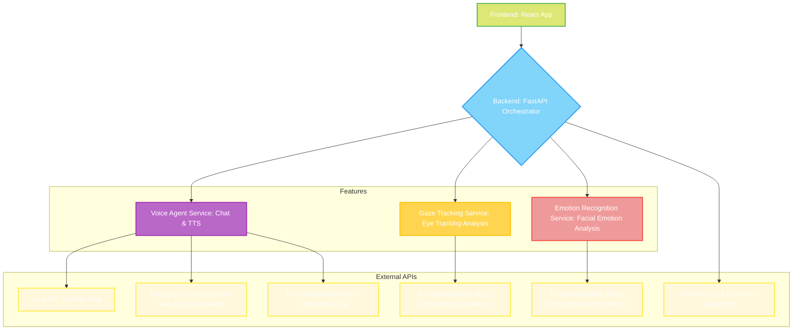

# Backend Architecture

This `backend` directory houses the core FastAPI application, which acts as the central orchestration layer for the entire multimodal mental health assessment system. It is designed to integrate various specialized microservices, processing diverse data streams (voice, gaze, emotion) to generate comprehensive psychological assessment reports.

## Overall Project Architecture

The project follows a microservice-oriented architecture, where distinct services handle specific functionalities and communicate via well-defined APIs. The FastAPI backend orchestrates these services and the frontend interaction.


*Figure 1: Overall Project Architecture Diagram. This diagram illustrates the high-level components of the system, showing how the Frontend interacts with the Backend Orchestrator, which in turn communicates with various microservices and external APIs (Groq, Deepgram, Pinecone/Cohere).* 

## Backend Architecture and Interconnections

The FastAPI backend (`app.main.py`) serves as the central hub, responsible for:

1.  **Session Management**: Handles the lifecycle of an assessment session, from initiation to final report generation.
2.  **Data Ingestion**: Receives real-time data streams (e.g., video frames for gaze/emotion, user speech transcripts) from the frontend.
3.  **Microservice Coordination**: Acts as a client to various specialized microservices, forwarding relevant data for processing and receiving analyzed results.
    *   **Gaze Tracking Service**: Processes eye-tracking data to derive metrics like attention, focus, and blink rate.
    *   **Emotion Recognition Service**: Analyzes facial expressions to detect and categorize emotions, along with their intensity and duration.
    *   **Voice Agent Service**: Manages the conversational AI (chatbot) functionality, including speech-to-text (STT), text-to-speech (TTS), and RAG (Retrieval Augmented Generation) for informed responses.
4.  **Report Generation**: Aggregates all processed data and conversation history to prompt a powerful Large Language Model (LLM) (via Groq API) to generate a comprehensive, personalized mental health assessment report.

Communication between the FastAPI backend and other microservices is primarily via **HTTP POST requests** for data submission and **HTTP GET/POST** for result retrieval. Each microservice is assumed to expose its own API endpoints that the main backend consumes.

## Voice Agent Architecture

The Voice Agent is a crucial component responsible for the interactive conversational aspect of the assessment. It combines speech recognition, natural language understanding, and speech synthesis.

### Voice Agent: Real-time Conversation Flow


*Figure 2: Voice Agent Real-time Conversation Flow. This sequence diagram illustrates the continuous interaction loop for the voice-driven conversation, including speech-to-text, RAG context retrieval, LLM interaction, and text-to-speech.*

### Voice Agent: Internal Components and Data Flow

```mermaid
graph TD
    A[Live Audio Input (Microphone)]
    B(Deepgram STT Client)
    C{Transcription Events}
    D[Transcript Buffer]
    E[User Message Processing]
    F{Groq Chat API}
    G[Cohere Embeddings]
    H[Pinecone Vector DB]
    I[RAG Context Retrieval]
    J[AI Text Response]
    K(Deepgram TTS Client)
    L[Audio Output (Speaker)]

    A --> B
    B --> C
    C --> D
    D --> E
    E --> F
    E --> G
    G --> H
    H --> I
    I --> F
    F --> J
    J --> K
    K --> L

    subgraph Voice Agent (`backend/voiceAgent`)
        B
        C
        D
        E
        F
        G
        H
        I
        J
        K
    end

    style A fill:#DCE775,stroke:#4CAF50,stroke-width:2px,color:#FFFFFF
    style L fill:#DCE775,stroke:#4CAF50,stroke-width:2px,color:#FFFFFF
    style B fill:#81D4FA,stroke:#2196F3,stroke-width:2px,color:#FFFFFF
    style C fill:#BA68C8,stroke:#9C27B0,stroke-width:2px,color:#FFFFFF
    style D fill:#FFD54F,stroke:#FFC107,stroke-width:2px,color:#FFFFFF
    style E fill:#EF9A9A,stroke:#F44336,stroke-width:2px,color:#FFFFFF
    style F fill:#FFF8DC,stroke:#FFEB3B,stroke-width:2px,color:#FFFFFF
    style G fill:#FFF8DC,stroke:#FFEB3B,stroke-width:2px,color:#FFFFFF
    style H fill:#FFF8DC,stroke:#FFEB3B,stroke-width:2px,color:#FFFFFF
    style I fill:#FFF8DC,stroke:#FFEB3B,stroke-width:2px,color:#FFFFFF
    style J fill:#FFF8DC,stroke:#FFEB3B,stroke-width:2px,color:#FFFFFF
    style K fill:#FFF8DC,stroke:#FFEB3B,stroke-width:2px,color:#FFFFFF

```
*Figure 3: Voice Agent Internal Components and Data Flow. This diagram details the internal mechanisms of the Voice Agent, from live audio input to text processing, RAG integration, LLM interaction, and audio output.*

## API Endpoints

*   **`POST /start-session`**: Initiates a new assessment session or processes post-session data. Expects chat messages, and optionally gaze and emotion data.
*   **`GET /`**: A simple root endpoint to confirm the API is running.
*   **`POST /generate-eye-tracking-report`**: (Internal/Proxy) Forwards requests to the external gaze tracking service to generate a report from raw gaze data.
*   **`GET /get-report`**: Retrieves the last generated comprehensive assessment report.

## Environment Variables

Ensure you have a `.env` file in the `backend/app` directory with the following configuration:

```
GROQ_API_KEY="your_groq_api_key_here"
FRONTEND_ORIGINS="http://localhost:8080" # Or your frontend's URL

# URLs for external microservices (adjust if running on different ports/hosts)
GAZE_CAPTURE_URL="http://127.0.0.1:8001/capture-eye-tracking"
GAZE_REPORT_URL="http://127.0.0.1:8001/generate-eye-tracking-report"
EMOTION_API_URL="http://127.0.0.1:8000/analyze-live-emotion"
CHAT_API_URL="http://127.0.0.1:8002/chat"
TRANSCRIPT_GET_URL="http://127.0.0.1:8002/transcript"
```

## How to Run

1.  **Navigate to the `backend` directory**:
    ```bash
    cd backend
    ```
2.  **Set up a Python virtual environment** (recommended):
    ```bash
    python -m venv venv
    # On Windows:
    venv\Scripts\activate
    # On macOS/Linux:
    source venv/bin/activate
    ```
3.  **Install dependencies**:
    ```bash
    pip install --upgrade pip
    pip install -r requirements.txt
    ```
4.  **Create your `.env` file** as described in the "Environment Variables" section.
5.  **Run the FastAPI application**:
    ```bash
    uvicorn app.main:app --reload --port 8003
    ```
    (Ensure your gaze tracking, emotion recognition, and voice chat/TTS microservices are also running on their respective ports, e.g., 8000, 8001, 8002.)

This will start the backend server, typically accessible at `http://127.0.0.1:8003`.

